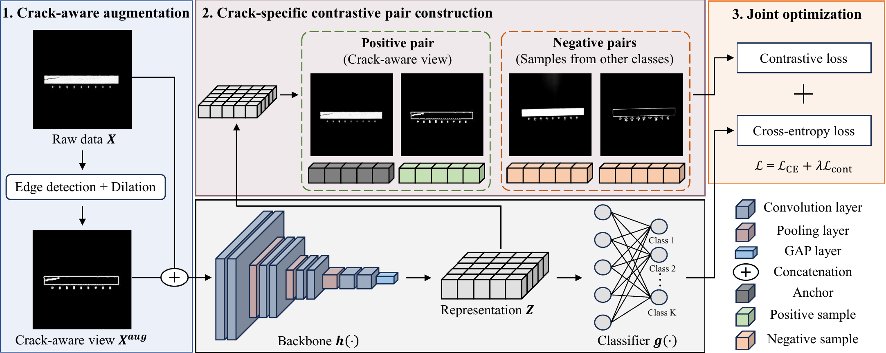

# Crack-Oriented Contrastive Learning (COCL)

Official PyTorch implementation of **"Crack-oriented contrastive learning for surface defect classification"** (Applied Soft Computing, in press).

## Overview



COCL is a training framework for crack-type surface defect classification with three components:

1. **Crack-aware augmentation.** An edge map of the raw image is obtained with Canny and dilated with a 3×3 kernel, which yields the crack-aware view.
2. **Crack-specific contrastive pair construction.** Each raw image and its crack-aware view form an instance-level positive pair. Views from other classes are negatives. Other views from the same class are excluded from the contrastive term.
3. **Joint optimization.** Raw images and crack-aware views are concatenated along the batch dimension. The model is trained with $`\mathcal{L} = \mathcal{L}_{CE} + \lambda \mathcal{L}_{cont}`$.

COCL changes the training procedure but not the architecture. At test time, the model uses only raw images.

## Repository Structure

```
COCL/
├── cocl/
│   ├── data.py      # Paired raw / crack-aware image dataset
│   ├── loss.py      # Crack-oriented contrastive loss
│   ├── model.py     # VGG-16 backbone + linear classifier
│   └── utils.py     # Seeding and evaluation metrics
├── train.py         # Training with early stopping, then test evaluation
├── test.py          # Evaluation of a trained checkpoint
├── assets/
└── LICENSE
```

## Requirements

- Python 3.9.19
- PyTorch 2.3.1
- torchvision 0.18.1
- CUDA 11.8
- NumPy 1.26.3
- Pillow 10.2.0
- scikit-learn 1.5.1

## Data Preparation

The datasets used in the paper are not distributed with this repository. Prepare your data in the following layout. Class names are taken from the subfolder names.

```
data_root/
├── train/        # raw training images:  <class>/<image>
├── train_aug/    # crack-aware views:     <class>/<image>
├── val/          # raw validation images
└── test/         # raw test images
```

The crack-aware views are precomputed once before training. Each view in `train_aug/` must have the same relative path as its raw image in `train/`. In the paper, the views were generated with the Canny detector using adaptive thresholds, followed by dilation with a 3×3 square kernel. Validation and test sets use raw images only.

## Usage

**Training.** The checkpoint with the lowest validation cross-entropy loss is saved to `--output_dir/best_model.pth` and then evaluated on `test/`.

```bash
python train.py --data_root /path/to/data_root --lambda_c 0.01 --temperature 0.1
```

| Argument | Default | Description |
|---|---|---|
| `--lambda_c` | 0.01 | Contrastive loss weight λ |
| `--temperature` | 0.1 | Temperature τ |
| `--batch_size` | 64 | Mini-batch size B |
| `--lr` | 1e-3 | Adam learning rate |
| `--patience` | 5 | Early-stopping patience (validation CE loss) |
| `--epochs` | 300 | Maximum number of epochs |
| `--seed` | 0 | Random seed |
| `--output_dir` | `checkpoints` | Directory for the best checkpoint |

**Evaluation.**

```bash
python test.py --test_dir /path/to/data_root/test --checkpoint checkpoints/best_model.pth
```

## Citation

The paper has been accepted and is in press. Volume and page numbers will be added after publication.

```bibtex
@article{park2026cocl,
  title   = {Crack-oriented contrastive learning for surface defect classification},
  author  = {Park, Byeongtae and Kim, Seonggyeom and Chae, Dong-Kyu and Joung, Junegak},
  journal = {Applied Soft Computing},
  year    = {2026},
  doi     = {10.1016/j.asoc.2026.116564}
}
```

## License

This project is released under the [MIT License](LICENSE).
