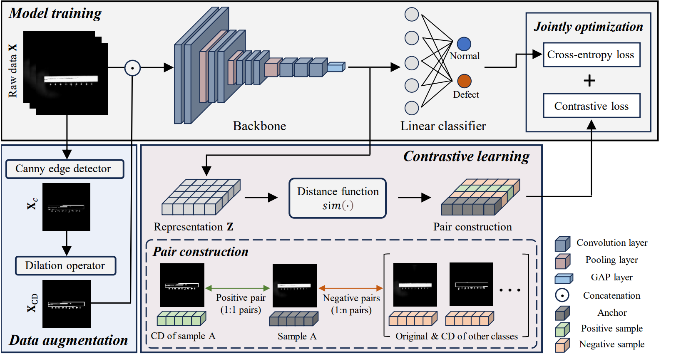

# Crack-oriented contrastive learning for enhanced surface defect detection: a universally applicable approach

**The code will be released after the publication of the corresponding paper.**

## Overview


## Preparation
### Environments
```
Python: 3.9.19
PyTorch: 2.3.1
Torchvision: 0.18.1
CUDA: 11.8
NumPy: 1.26.3
PIL: 10.2.0
timm: 1.0.9
```

### Dataset
MixedWM38 : [WaferMap Dataset: MixedWM38](https://github.com/Junliangwangdhu/WaferMap?tab=readme-ov-file)

'''
tar -xzvf ~.tar.gz
'''

## Usage
### Data augmentation
